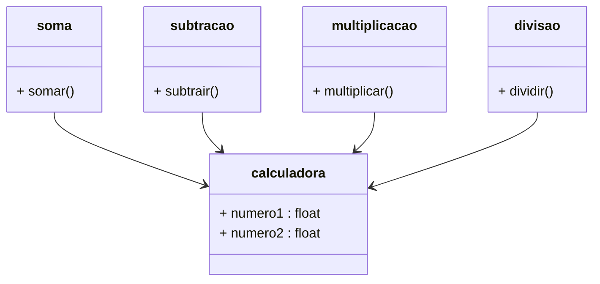

# Calculadora Colaborativa
> Uma simples calculadora criada com o objetivo de estudar git e colaborar com os colega da turma do Start By Proa.

## Ferramentas
- Git
- GitHub
- Python
- Pytest

## Diagrama das classes do projeto
